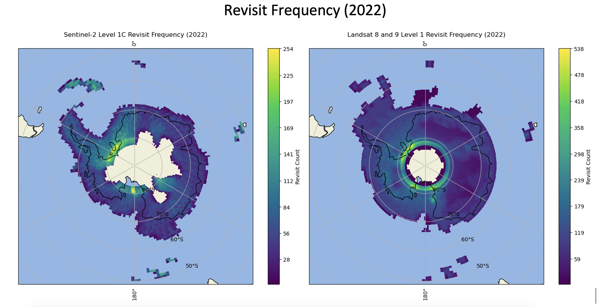
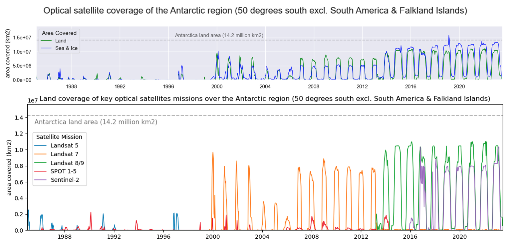

# Antarctica Coverage
This repo contains the scripts necessary to download and analyse metadata for various satellite missions over the Antarctic region. 

## Key Notebooks

 - **envrionment.yaml** -> Conda envrionment for notebooks
 - **download_metadata.ipynb** -> notebook for searching various API's and downloading data for the Antarctic region
 - **coverage_MISSION.ipynb** -> notebook to investigate the coverage of the specified mission
 - **all_satellites.ipynb** -> notebook to combine and assess the temporal and spatial coverage of key satellites together

## Quick Instructions

 - Clone repository
 - Install environment dependancies with conda
 - Download metadata for satellite of interest with **download_metadata.ipynb**. Note you may need to setup credentials for the corresponding API. These should be stored in a text file in a folder called credentials, with the structure shown in **credentials.txt**
 - Assess metadata with corresponding coverage script or create a new one
 - Some shapefiles may need to be downloaded (e.g. sentinel-2 and Landsat grids)

